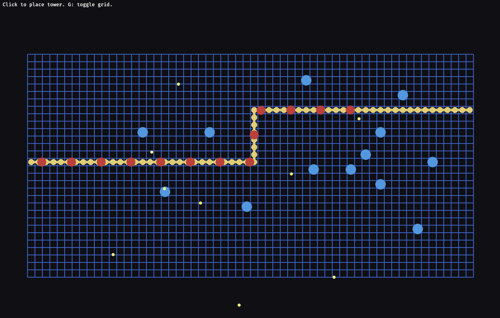

# Tower Defense Demo

A small 2D tower defense prototype written in Rust with [Bevy](https://bevyengine.org/) 0.11. Enemies spawn on a gold path, you place towers on the grid, and towers fire at the nearest target in range.



The playfield is a 60×30 grid (1350×900 window). A yellow orthogonal path runs across it: right, then up, then right again. Red circles (enemies) spawn at the start of the path every second, follow it, and despawn if they reach the end. Click an empty cell to place a blue tower. Towers cannot sit on the path or on another tower. Each tower shoots the nearest enemy within range about every 0.7 seconds; two hits destroy an enemy.

## Run

Requires a recent [Rust](https://www.rust-lang.org/tools/install) toolchain.

```bash
cargo run
```

The first build downloads and compiles Bevy, so it may take a while. Later runs are faster.

## Controls

- **Left click** — place a tower on the cell under the cursor
- **G** — show or hide the grid

## License

This project is licensed under the [MIT License](LICENSE).
